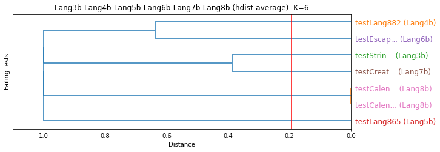
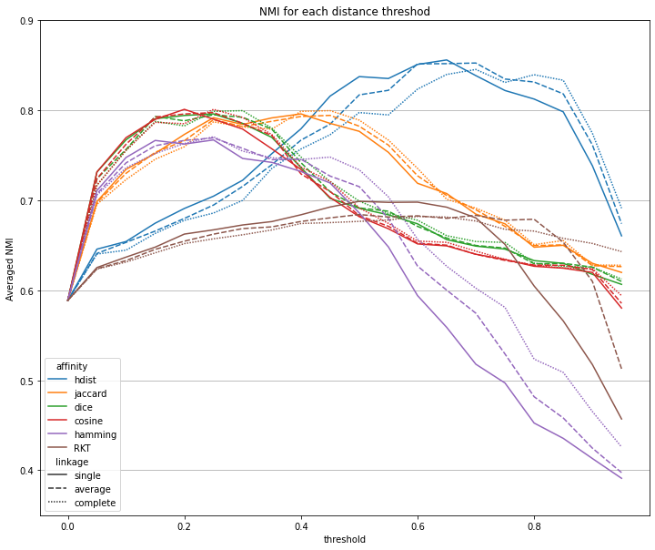
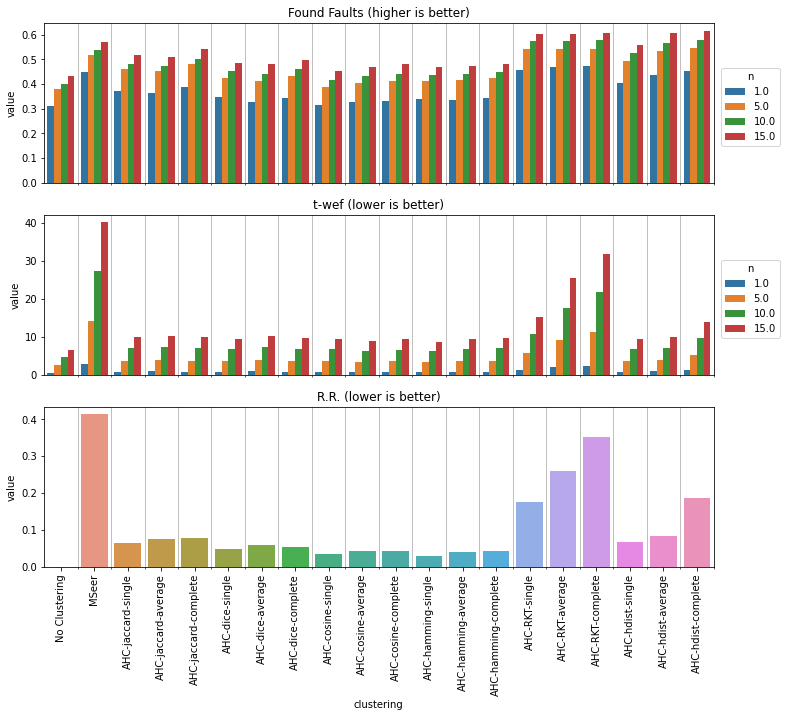

# Environment
- The experiment has been conducted on a PC with Intel Core i7-7700 CPU @ 3.60GHz and 32GB memory.

# Hybiscus Clustering Example

- The dendrogram cutting threshold is determined using the distance-based stopping criterion of Hybiscus (described in our paper).

## \# actual faults = 1

## \# actual faults = 2

## \# actual faults >= 3

# Subject Statistics

## Java (Defects4J)
| Project   |                       \# faults |                         \# subjects |                           Avg. \# failing test cases | Avg. \# program components |
|:----------|--------------------------------:|------------------------------------:|-----------------------------------------------------:|---------------------------:|
| Lang      | 1 2 3 4 5 6 7 | 17 41 29 16 9 5 2 | 4.47 2.39 3.48 4.50 5.44 6.60 8.00 |                     9457.2 |
| Chart     |                     1 2 3 |                       10 12 3 |                                 7.60 5.42 6.67 |                    25558.2 |
| Time      |                     1 2 3 |                       12 18 6 |                                 5.00 5.67 8.17 |                    12095.9 |
| Math      |                     1 2 3 |                      28 61 24 |                                 3.50 3.05 3.67 |                    21854.9 |
| Closure   |                     1 2 3 |                     57 108 17 |                                5.79 5.26 14.71 |                    37162.8 |
| **Total**                                  ||                                 475 |                                                 4.80 |                    24069.6 |

## C (SIR)
| Project   |                       \# faults |                         \# subjects |                           Avg. \# failing test cases | Avg. \# program components |
|:----------|--------------------------------:|------------------------------------:|-----------------------------------------------------:|---------------------------:|
| flex      |                     1 2 3 |                       28 21 1 |                               15.64 10.05 6.00 |                     2808.2 |
| grep      |                     1 2 3 |                        10 7 2 |                              50.50 36.57 45.50 |                     1879.9 |
| gzip      |                1 2 3 4 |                  10 20 13 3 |                     72.90 58.50 42.38 24.00 |                     1272.7 |
| sed       |                     1 2 3 |                         6 6 3 |                                 3.17 5.33 8.00 |                     1119.3 |
| **Total**                                  ||                                 130 |                                                31.57 |                     1934.3 |

# **RQ1**: Distance Metric
## Java

| affinity   | linkage   |   normalized_mutual_info_score |   perfect_ratio |
|:----------:|:---------:|-------------------------------:|----------------:|
| jaccard    | single    |                          0.981 |           0.922 |
|            | average   |                          0.981 |           0.922 |
|            | complete  |                          0.981 |           0.922 |
| dice       | single    |                          0.981 |           0.922 |
|            | average   |                          0.981 |           0.922 |
|            | complete  |                          0.981 |           0.922 |
| cosine     | single    |                          0.984 |           0.931 |
|            | average   |                          0.984 |           0.928 |
|            | complete  |                          0.982 |           0.926 |
| euclidean  | single    |                          0.974 |           0.886 |
|            | average   |                          0.972 |           0.882 |
|            | complete  |                          0.972 |           0.884 |
| hamming    | single    |                          0.974 |           0.886 |
|            | average   |                          0.972 |           0.882 |
|            | complete  |                          0.972 |           0.884 |
| RKT        | single    |                          0.984 |           0.912 |
|            | average   |                          0.982 |           0.909 |
|            | complete  |                          0.98  |           0.905 |
| hdist      | single    |                          0.99  |           0.949 |
|            | average   |                      **0.991** |       **0.952** |
|            | complete  |                          0.99  |       **0.952** |

## C

| affinity   | linkage   |   normalized_mutual_info_score |   perfect_ratio |
|:----------:|:---------:|-------------------------------:|----------------:|
| jaccard    | single    |                          0.948 |           0.838 |
|            | average   |                          0.944 |           0.846 |
|            | complete  |                          0.917 |           0.8   |
| dice       | single    |                          0.948 |           0.838 |
|            | average   |                          0.944 |           0.846 |
|            | complete  |                          0.917 |           0.8   |
| cosine     | single    |                          0.948 |           0.838 |
|            | average   |                          0.945 |           0.846 |
|            | complete  |                          0.924 |           0.808 |
| euclidean  | single    |                          0.951 |           0.846 |
|            | average   |                          0.952 |           0.846 |
|            | complete  |                          0.925 |           0.823 |
| hamming    | single    |                          0.951 |           0.846 |
|            | average   |                          0.951 |           0.846 |
|            | complete  |                          0.925 |           0.823 |
| RKT        | single    |                          0.938 |           0.862 |
|            | average   |                          0.937 |           0.862 |
|            | complete  |                          0.913 |           0.823 |
| hdist      | single    |                      **0.953** |           0.854 |
|            | average   |                          0.952 |       **0.869** |
|            | complete  |                          0.928 |           0.823 |

# **RQ2**: Stopping Criteria
## Baselines

### Java

| clustering   |   num_clusters/num_faults |   num_clusters==num_faults |   homogeneity_score |   completeness_score |   normalized_mutual_info_score |   perfect_ratio |
|:------------:|--------------------------:|---------------------------:|--------------------:|---------------------:|-------------------------------:|----------------:|
| MSeer        |                     1.673 |                      0.413 |               0.985 |                0.601 |                          0.644 |           0.406 |
| TCN          |                     1.262 |                      0.657 |               0.95  |                0.818 |                          0.802 |           0.646 |

### C

| clustering   |   num_clusters/num_faults |   num_clusters==num_faults |   homogeneity_score |   completeness_score |   normalized_mutual_info_score |   perfect_ratio |
|:------------:|--------------------------:|---------------------------:|--------------------:|---------------------:|-------------------------------:|----------------:|
| MSeer        |                     3.188 |                      0.262 |               0.855 |                0.479 |                          0.427 |           0.246 |

## Stopping Criterion 1: Elbow Method (Algorihm 2 in the paper)

### Java
| affinity   | linkage   |   num_clusters/num_faults |   num_clusters==num_faults |   homogeneity_score |   completeness_score |   normalized_mutual_info_score |   perfect_ratio |
|:----------:|:---------:|--------------------------:|---------------------------:|--------------------:|---------------------:|-------------------------------:|----------------:|
| jaccard    | single    |                     1.02  |                      0.682 |               0.826 |                0.907 |                          0.753 |           0.674 |
|            | average   |                     1.029 |                      0.678 |               0.83  |                0.901 |                          0.753 |           0.669 |
|            | complete  |                     1.041 |                      0.686 |               0.84  |                0.894 |                          0.761 |           0.674 |
| dice       | single    |                     0.898 |                      0.629 |               0.717 |                0.953 |                          0.685 |           0.621 |
|            | average   |                     0.917 |                      0.629 |               0.721 |                0.946 |                          0.684 |           0.619 |
|            | complete  |                     0.937 |                      0.625 |               0.729 |                0.935 |                          0.686 |           0.615 |
| cosine     | single    |                     0.881 |                      0.621 |               0.701 |                0.962 |                          0.676 |           0.617 |
|            | average   |                     0.898 |                      0.621 |               0.702 |                0.957 |                          0.673 |           0.615 |
|            | complete  |                     0.911 |                      0.625 |               0.709 |                0.948 |                          0.675 |           0.613 |
| hamming    | single    |                     0.882 |                      0.571 |               0.69  |                0.926 |                          0.641 |           0.56  |
|            | average   |                     0.894 |                      0.583 |               0.704 |                0.916 |                          0.658 |           0.564 |
|            | complete  |                     0.929 |                      0.604 |               0.746 |                0.899 |                          0.698 |           0.577 |
| RKT        | single    |                     1.363 |                      0.547 |               0.957 |                0.705 |                          0.697 |           0.539 |
|            | average   |                     1.416 |                      0.539 |               0.971 |                0.689 |                          0.695 |           0.531 |
|            | complete  |                     1.423 |                      0.535 |               0.976 |                0.673 |                          0.686 |           0.524 |
| hdist      | single    |                     1.195 |                      0.688 |               0.949 |                0.848 |                          0.826 |           0.678 |
|            | average   |                     1.205 |                      0.688 |               0.958 |                0.846 |                      **0.833** |       **0.68**  |
|            | complete  |                     1.218 |                      0.688 |               0.963 |                0.839 |                          0.832 |       **0.68**  |

### C
| affinity   | linkage   |   num_clusters/num_faults |   num_clusters==num_faults |   homogeneity_score |   completeness_score |   normalized_mutual_info_score |   perfect_ratio |
|:----------:|:---------:|--------------------------:|---------------------------:|--------------------:|---------------------:|-------------------------------:|----------------:|
| jaccard    | single    |                     0.863 |                      0.585 |               0.688 |                0.967 |                          0.67  |           0.585 |
|            | average   |                     0.88  |                      0.592 |               0.694 |                0.959 |                          0.669 |           0.585 |
|            | complete  |                     0.897 |                      0.623 |               0.728 |                0.952 |                          0.693 |           0.615 |
| dice       | single    |                     0.792 |                      0.554 |               0.616 |                0.993 |                          0.62  |           0.554 |
|           | average   |                     0.82  |                      0.577 |               0.645 |                0.974 |                          0.638 |           0.562 |
|           | complete  |                     0.833 |                      0.577 |               0.654 |                0.967 |                          0.633 |           0.577 |
| cosine     | single    |                     0.769 |                      0.508 |               0.569 |                0.987 |                          0.566 |           0.508 |
|            | average   |                     0.78  |                      0.531 |               0.578 |                0.978 |                          0.567 |           0.523 |
|            | complete  |                     0.808 |                      0.569 |               0.622 |                0.968 |                          0.602 |           0.562 |
| hamming    | single    |                     0.764 |                      0.508 |               0.578 |                0.992 |                          0.582 |           0.508 |
|            | average   |                     0.795 |                      0.538 |               0.615 |                0.98  |                          0.613 |           0.531 |
|            | complete  |                     0.823 |                      0.554 |               0.65  |                0.955 |                          0.637 |           0.531 |
| RKT        | single    |                     1.255 |                      0.585 |               0.831 |                0.802 |                          0.646 |           0.577 |
|            | average   |                     1.817 |                      0.546 |               0.9   |                0.71  |                          0.627 |           0.538 |
|            | complete  |                     2.39  |                      0.415 |               0.938 |                0.561 |                          0.53  |           0.408 |
| hdist      | single    |                     0.859 |                      0.685 |               0.718 |                0.989 |                          0.713 |           0.677 |
|            | average   |                     0.935 |                      0.738 |               0.798 |                0.971 |                      **0.776** |       **0.731** |
|            | complete  |                     1.347 |                      0.585 |               0.846 |                0.835 |                          0.709 |           0.585 |

## Stopping Criterion 2: Maximum Modualrity 

### Java
| affinity   | linkage   |   num_clusters/num_faults |   num_clusters==num_faults |   homogeneity_score |   completeness_score |   normalized_mutual_info_score |   perfect_ratio |
|:----------:|:---------:|--------------------------:|---------------------------:|--------------------:|---------------------:|-------------------------------:|----------------:|
| jaccard    | single    |                     0.871 |                      0.518 |               0.619 |                0.944 |                          0.59  |           0.501 |
|            | average   |                     0.865 |                      0.509 |               0.618 |                0.94  |                          0.587 |           0.495 |
|            | complete  |                     0.856 |                      0.512 |               0.616 |                0.94  |                          0.584 |           0.495 |
| dice       | single    |                     0.816 |                      0.516 |               0.596 |                0.964 |                          0.581 |       **0.503** |
|            | average   |                     0.817 |                      0.514 |               0.599 |                0.963 |                          0.584 |       **0.503** |
|            | complete  |                     0.811 |                      0.516 |               0.597 |                0.962 |                          0.582 |       **0.503** |
| cosine     | single    |                     0.815 |                      0.509 |               0.597 |                0.968 |                          0.581 |       **0.503** |
|            | average   |                     0.815 |                      0.509 |               0.598 |                0.968 |                          0.583 |       **0.503** |
|            | complete  |                     0.811 |                      0.509 |               0.595 |                0.967 |                          0.581 |       **0.503** |
| hamming    | single    |                     0.701 |                      0.377 |               0.421 |                0.961 |                          0.401 |           0.36  |
|            | average   |                     0.701 |                      0.375 |               0.421 |                0.959 |                          0.399 |           0.358 |
|            | complete  |                     0.695 |                      0.381 |               0.419 |                0.958 |                          0.398 |           0.358 |
| RKT        | single    |                     1.071 |                      0.352 |               0.616 |                0.786 |                          0.422 |           0.343 |
|            | average   |                     1.035 |                      0.347 |               0.623 |                0.777 |                          0.427 |           0.337 |
|            | complete  |                     1.028 |                      0.352 |               0.623 |                0.774 |                          0.427 |           0.335 |
| hdist      | single    |                     0.979 |                      0.509 |               0.64  |                0.933 |                      **0.595** |           0.501 |
|            | average   |                     0.942 |                      0.505 |               0.639 |                0.934 |                      **0.595** |           0.499 |
|            | complete  |                     0.92  |                      0.501 |               0.639 |                0.933 |                      **0.595** |           0.497 |

### C
| affinity   | linkage   |   num_clusters/num_faults |   num_clusters==num_faults |   homogeneity_score |   completeness_score |   normalized_mutual_info_score |   perfect_ratio |
|:----------:|:---------:|--------------------------:|---------------------------:|--------------------:|---------------------:|-------------------------------:|----------------:|
| jaccard    | single    |                     1.329 |                      0.408 |               0.698 |                0.811 |                          0.532 |           0.408 |
|            | average   |                     1.208 |                      0.4   |               0.697 |                0.806 |                          0.529 |           0.392 |
|            | complete  |                     1.278 |                      0.385 |               0.692 |                0.773 |                          0.501 |           0.369 |
| dice       | single    |                     1.141 |                      0.446 |               0.671 |                0.856 |                          0.548 |           0.438 |
|            | average   |                     1.044 |                      0.431 |               0.667 |                0.851 |                          0.542 |           0.423 |
|            | complete  |                     1.016 |                      0.423 |               0.669 |                0.847 |                          0.539 |           0.423 |
| cosine     | single    |                     1.115 |                      0.469 |               0.671 |                0.874 |                      **0.565** |       **0.462** |
|            | average   |                     1.029 |                      0.446 |               0.667 |                0.866 |                          0.557 |           0.438 |
|            | complete  |                     1.024 |                      0.438 |               0.669 |                0.863 |                          0.555 |           0.438 |
| hamming    | single    |                     1.159 |                      0.438 |               0.669 |                0.853 |                          0.547 |           0.431 |
|            | average   |                     1.133 |                      0.431 |               0.667 |                0.853 |                          0.546 |           0.423 |
|            | complete  |                     1.04  |                      0.446 |               0.671 |                0.855 |                          0.551 |           0.438 |
| RKT        | single    |                     1.915 |                      0.431 |               0.802 |                0.658 |                          0.494 |           0.423 |
|            | average   |                     1.703 |                      0.408 |               0.82  |                0.627 |                          0.489 |           0.392 |
|            | complete  |                     1.648 |                      0.415 |               0.79  |                0.63  |                          0.479 |           0.377 |
| hdist      | single    |                     1.726 |                      0.454 |               0.716 |                0.8   |                          0.535 |           0.454 |
|            | average   |                     1.571 |                      0.423 |               0.71  |                0.8   |                          0.531 |           0.423 |
|            | complete  |                     1.502 |                      0.431 |               0.702 |                0.792 |                          0.524 |           0.415 |

## Stopping Criterion 3: Distance Threshold

### Java

### C

## Comparison of stopping criteria 1,2,3

Elbow method always outperforms max-modularity for all distance metrics.

### Java

### C

# **RQ3**: Efficiency
## Distribution of distance calculation cost

## Time Complexity of RKT

- Computation Time (s) ~ $3.0 \times 10^{-9} \times M^2 \times |T_F|^2 - 2.7$
  - $M$: the number of total program components
  - $T_F$: the number of failing test cases
  
- Correlation coefficient (R) = 0.9997852198552228
- $R^2$ = 0.9995704858409563
- Standard error of the estimated slope: 2.528077918861989e-12

## Time Complexity of hdist

- Computation Time (s) ~ $3.1 \times 10^{-5} \times  M + 8.4 \times 10^{-5} \times  E + 1.5 \times 10^{-6} \times  |T_F| - 0.074$
  - $M$: the number of total program components
  - $E$: the number of program components executed by at lease one failing test case, i.e., the number of hyperedges in the restricted hypergraph
  - $T_F$: the number of failing test cases

- Correlation coefficient (R) = 0.9551503058197278
- $R^2$ = 0.9123121067075196
- Standard error of the estimated slope: 0.012625234238839567

# **RQ4**: FL Accuracy
R.R. : Redundant Rankings

## Java
### Ochiai (tie-breaker: min)

| clustering           |   R.R. |   found_faults (n=1) |   t_wef (n=1) |   found_faults (n=5) |   t_wef (n=5) |   found_faults (n=10) |   t_wef (n=10) |   found_faults (n=15) |   t_wef (n=15) |   found_faults (n=inf) |   t_wef (n=inf) |
|:---------------------|-------:|---------------------:|--------------:|---------------------:|--------------:|----------------------:|---------------:|----------------------:|---------------:|-----------------------:|----------------:|
| No Clustering        |  0     |                0.227 |         0.547 |                0.377 |         1.85  |                 0.412 |          2.847 |                 0.431 |          3.552 |                  0.499 |          10.057 |
| MSeer                |  0.223 |                0.577 |         1.463 |                0.786 |         5.402 |                 0.839 |          8.979 |                 0.864 |         11.8   |                  0.981 |          60.743 |
| TCN                  |  0.12  |                0.532 |         1.166 |                0.771 |         4.179 |                 0.823 |          6.84  |                 0.85  |          8.958 |                  0.971 |          46.118 |
| AHC-jaccard-single   |  0.068 |                0.503 |         0.882 |                0.723 |         3.059 |                 0.764 |          4.903 |                 0.794 |          6.324 |                  0.908 |          32.707 |
| AHC-jaccard-average  |  0.07  |                0.503 |         0.893 |                0.725 |         3.107 |                 0.764 |          4.994 |                 0.794 |          6.455 |                  0.91  |          33.619 |
| AHC-jaccard-complete |  0.074 |                0.505 |         0.907 |                0.73  |         3.154 |                 0.769 |          5.061 |                 0.8   |          6.537 |                  0.916 |          34.423 |
| AHC-dice-single      |  0.045 |                0.478 |         0.735 |                0.694 |         2.442 |                 0.737 |          3.851 |                 0.762 |          4.888 |                  0.855 |          20.442 |
| AHC-dice-average     |  0.044 |                0.482 |         0.76  |                0.695 |         2.528 |                 0.738 |          3.973 |                 0.764 |          5.027 |                  0.858 |          20.642 |
| AHC-dice-complete    |  0.053 |                0.486 |         0.787 |                0.702 |         2.636 |                 0.74  |          4.173 |                 0.766 |          5.335 |                  0.864 |          23.347 |
| AHC-cosine-single    |  0.039 |                0.477 |         0.709 |                0.685 |         2.352 |                 0.729 |          3.701 |                 0.757 |          4.691 |                  0.847 |          19.539 |
| AHC-cosine-average   |  0.041 |                0.48  |         0.731 |                0.686 |         2.413 |                 0.73  |          3.777 |                 0.758 |          4.777 |                  0.848 |          19.632 |
| AHC-cosine-complete  |  0.044 |                0.481 |         0.752 |                0.692 |         2.501 |                 0.731 |          3.935 |                 0.761 |          4.983 |                  0.853 |          20.377 |
| AHC-hamming-single   |  0.053 |                0.436 |         0.752 |                0.654 |         2.556 |                 0.696 |          4.059 |                 0.723 |          5.223 |                  0.838 |          28.834 |
| AHC-hamming-average  |  0.06  |                0.442 |         0.771 |                0.657 |         2.657 |                 0.7   |          4.236 |                 0.727 |          5.459 |                  0.844 |          28.604 |
| AHC-hamming-complete |  0.059 |                0.459 |         0.808 |                0.68  |         2.764 |                 0.717 |          4.4   |                 0.75  |          5.659 |                  0.867 |          29.503 |
| AHC-RKT-single       |  0.155 |                0.543 |         1.164 |                0.768 |         4.177 |                 0.82  |          6.882 |                 0.844 |          9.013 |                  0.968 |          46.385 |
| AHC-RKT-average      |  0.158 |                0.552 |         1.204 |                0.776 |         4.259 |                 0.829 |          6.983 |                 0.853 |          9.124 |                  0.974 |          47.467 |
| AHC-RKT-complete     |  0.165 |                0.557 |         1.206 |                0.782 |         4.297 |                 0.836 |          7.044 |                 0.861 |          9.208 |                  0.976 |          47.815 |
| AHC-hdist-single     |  0.089 |                0.546 |         1.023 |                0.764 |         3.566 |                 0.815 |          5.865 |                 0.844 |          7.604 |                  0.967 |          35.286 |
| AHC-hdist-average    |  0.091 |                0.546 |         1.053 |                0.765 |         3.701 |                 0.818 |          6.095 |                 0.848 |          7.912 |                  0.973 |          38.867 |
| AHC-hdist-complete   |  0.094 |                0.554 |         1.063 |                0.767 |         3.737 |                 0.818 |          6.183 |                 0.849 |          8.053 |                  0.975 |          40.305 |

### Ochiai (tie-breaker: max)

| clustering           |   R.R. |   found_faults (n=1) |   t_wef (n=1) |   found_faults (n=5) |   t_wef (n=5) |   found_faults (n=10) |   t_wef (n=10) |   found_faults (n=15) |   t_wef (n=15) |   found_faults (n=inf) |   t_wef (n=inf) |
|:---------------------|-------:|---------------------:|--------------:|---------------------:|--------------:|----------------------:|---------------:|----------------------:|---------------:|-----------------------:|----------------:|
| No Clustering        |  0     |                0.132 |         0.734 |                0.335 |         2.558 |                 0.385 |          3.875 |                 0.419 |          4.779 |                  0.499 |          21.643 |
| MSeer                |  0.192 |                0.371 |         2.105 |                0.754 |         7.069 |                 0.817 |         11.185 |                 0.852 |         14.427 |                  0.981 |         285.928 |
| TCN                  |  0.092 |                0.327 |         1.709 |                0.726 |         5.482 |                 0.797 |          8.623 |                 0.838 |         11.128 |                  0.971 |         234.118 |
| AHC-jaccard-single   |  0.042 |                0.31  |         1.343 |                0.678 |         4.156 |                 0.735 |          6.356 |                 0.782 |          7.966 |                  0.908 |         162.349 |
| AHC-jaccard-average  |  0.044 |                0.31  |         1.362 |                0.679 |         4.223 |                 0.736 |          6.476 |                 0.783 |          8.12  |                  0.91  |         177.288 |
| AHC-jaccard-complete |  0.046 |                0.311 |         1.379 |                0.683 |         4.276 |                 0.741 |          6.549 |                 0.789 |          8.211 |                  0.916 |         191.992 |
| AHC-dice-single      |  0.021 |                0.296 |         1.164 |                0.652 |         3.453 |                 0.71  |          5.156 |                 0.749 |          6.341 |                  0.855 |          98.552 |
| AHC-dice-average     |  0.022 |                0.296 |         1.194 |                0.652 |         3.556 |                 0.71  |          5.295 |                 0.751 |          6.499 |                  0.858 |          98.779 |
| AHC-dice-complete    |  0.026 |                0.301 |         1.223 |                0.657 |         3.684 |                 0.713 |          5.545 |                 0.756 |          6.855 |                  0.864 |         143.556 |
| AHC-cosine-single    |  0.016 |                0.295 |         1.135 |                0.643 |         3.347 |                 0.701 |          4.987 |                 0.744 |          6.124 |                  0.847 |          97.484 |
| AHC-cosine-average   |  0.016 |                0.295 |         1.16  |                0.645 |         3.423 |                 0.702 |          5.078 |                 0.745 |          6.225 |                  0.848 |          97.604 |
| AHC-cosine-complete  |  0.017 |                0.295 |         1.183 |                0.646 |         3.537 |                 0.703 |          5.286 |                 0.751 |          6.472 |                  0.853 |          98.375 |
| AHC-hamming-single   |  0.035 |                0.257 |         1.118 |                0.606 |         3.581 |                 0.666 |          5.394 |                 0.707 |          6.752 |                  0.838 |         121.002 |
| AHC-hamming-average  |  0.041 |                0.259 |         1.145 |                0.612 |         3.693 |                 0.672 |          5.606 |                 0.712 |          7.027 |                  0.844 |         106.859 |
| AHC-hamming-complete |  0.042 |                0.268 |         1.215 |                0.635 |         3.857 |                 0.691 |          5.844 |                 0.733 |          7.322 |                  0.867 |         107.634 |
| AHC-RKT-single       |  0.128 |                0.351 |         1.72  |                0.743 |         5.497 |                 0.805 |          8.531 |                 0.837 |         10.886 |                  0.968 |         241.543 |
| AHC-RKT-average      |  0.132 |                0.35  |         1.773 |                0.749 |         5.615 |                 0.81  |          8.672 |                 0.843 |         11.053 |                  0.974 |         249.987 |
| AHC-RKT-complete     |  0.14  |                0.351 |         1.779 |                0.751 |         5.701 |                 0.812 |          8.806 |                 0.847 |         11.274 |                  0.976 |         250.621 |
| AHC-hdist-single     |  0.06  |                0.353 |         1.556 |                0.732 |         4.857 |                 0.793 |          7.453 |                 0.834 |          9.421 |                  0.967 |         181.274 |
| AHC-hdist-average    |  0.067 |                0.353 |         1.585 |                0.734 |         4.992 |                 0.797 |          7.703 |                 0.838 |          9.773 |                  0.973 |         234.152 |
| AHC-hdist-complete   |  0.063 |                0.359 |         1.6   |                0.737 |         5.023 |                 0.797 |          7.804 |                 0.838 |          9.947 |                  0.975 |         235.648 |

### Crosstab (tie-breaker: min)

| clustering           |   R.R. |   found_faults (n=1) |   t_wef (n=1) |   found_faults (n=5) |   t_wef (n=5) |   found_faults (n=10) |   t_wef (n=10) |   found_faults (n=15) |   t_wef (n=15) |   found_faults (n=inf) |   t_wef (n=inf) |
|:---------------------|-------:|---------------------:|--------------:|---------------------:|--------------:|----------------------:|---------------:|----------------------:|---------------:|-----------------------:|----------------:|
| No Clustering        |  0     |                0.223 |         0.552 |                0.374 |         1.873 |                 0.408 |          2.873 |                 0.43  |          3.578 |                  0.497 |          15.309 |
| MSeer                |  0.203 |                0.577 |         1.463 |                0.786 |         5.402 |                 0.839 |          8.987 |                 0.864 |         11.808 |                  0.978 |         114.499 |
| TCN                  |  0.093 |                0.529 |         1.171 |                0.77  |         4.192 |                 0.823 |          6.861 |                 0.85  |          8.979 |                  0.97  |         101.171 |
| AHC-jaccard-single   |  0.047 |                0.503 |         0.882 |                0.722 |         3.076 |                 0.764 |          4.928 |                 0.794 |          6.349 |                  0.905 |          76.516 |
| AHC-jaccard-average  |  0.05  |                0.503 |         0.893 |                0.723 |         3.124 |                 0.764 |          5.019 |                 0.794 |          6.48  |                  0.906 |          77.427 |
| AHC-jaccard-complete |  0.05  |                0.505 |         0.907 |                0.728 |         3.171 |                 0.769 |          5.086 |                 0.8   |          6.562 |                  0.912 |          78.232 |
| AHC-dice-single      |  0.023 |                0.478 |         0.735 |                0.692 |         2.459 |                 0.735 |          3.872 |                 0.762 |          4.909 |                  0.854 |          53.274 |
| AHC-dice-average     |  0.025 |                0.482 |         0.76  |                0.693 |         2.545 |                 0.736 |          3.994 |                 0.764 |          5.048 |                  0.857 |          53.474 |
| AHC-dice-complete    |  0.028 |                0.486 |         0.787 |                0.7   |         2.653 |                 0.738 |          4.196 |                 0.766 |          5.358 |                  0.86  |          57.756 |
| AHC-cosine-single    |  0.019 |                0.477 |         0.709 |                0.683 |         2.371 |                 0.727 |          3.724 |                 0.757 |          4.714 |                  0.847 |          52.389 |
| AHC-cosine-average   |  0.019 |                0.48  |         0.731 |                0.684 |         2.429 |                 0.728 |          3.798 |                 0.758 |          4.798 |                  0.848 |          52.48  |
| AHC-cosine-complete  |  0.022 |                0.481 |         0.752 |                0.69  |         2.518 |                 0.729 |          3.956 |                 0.761 |          5.004 |                  0.852 |          53.208 |
| AHC-hamming-single   |  0.036 |                0.436 |         0.752 |                0.651 |         2.573 |                 0.695 |          4.078 |                 0.722 |          5.242 |                  0.836 |          71.061 |
| AHC-hamming-average  |  0.04  |                0.442 |         0.771 |                0.654 |         2.674 |                 0.699 |          4.259 |                 0.726 |          5.482 |                  0.842 |          61.442 |
| AHC-hamming-complete |  0.041 |                0.459 |         0.808 |                0.679 |         2.781 |                 0.717 |          4.425 |                 0.75  |          5.684 |                  0.866 |          62.343 |
| AHC-RKT-single       |  0.136 |                0.543 |         1.164 |                0.767 |         4.185 |                 0.82  |          6.899 |                 0.844 |          9.029 |                  0.966 |          93.627 |
| AHC-RKT-average      |  0.133 |                0.552 |         1.204 |                0.775 |         4.267 |                 0.829 |          7     |                 0.853 |          9.141 |                  0.972 |          99.019 |
| AHC-RKT-complete     |  0.145 |                0.557 |         1.206 |                0.781 |         4.309 |                 0.836 |          7.065 |                 0.861 |          9.229 |                  0.974 |          99.371 |
| AHC-hdist-single     |  0.065 |                0.546 |         1.023 |                0.762 |         3.583 |                 0.812 |          5.884 |                 0.844 |          7.623 |                  0.964 |          71.021 |
| AHC-hdist-average    |  0.065 |                0.546 |         1.053 |                0.764 |         3.718 |                 0.816 |          6.118 |                 0.848 |          7.935 |                  0.97  |          80.491 |
| AHC-hdist-complete   |  0.066 |                0.554 |         1.063 |                0.765 |         3.754 |                 0.816 |          6.211 |                 0.849 |          8.08  |                  0.972 |          81.933 |

### Crosstab (tie-breaker: max)

| clustering           |   R.R. |   found_faults (n=1) |   t_wef (n=1) |   found_faults (n=5) |   t_wef (n=5) |   found_faults (n=10) |   t_wef (n=10) |   found_faults (n=15) |   t_wef (n=15) |   found_faults (n=inf) |   t_wef (n=inf) |
|:---------------------|-------:|---------------------:|--------------:|---------------------:|--------------:|----------------------:|---------------:|----------------------:|---------------:|-----------------------:|----------------:|
| No Clustering        |  0     |                0.134 |         0.731 |                0.338 |         2.535 |                 0.385 |          3.836 |                 0.417 |          4.728 |                  0.497 |          18.28  |
| MSeer                |  0.199 |                0.371 |         2.103 |                0.754 |         7.059 |                 0.817 |         11.175 |                 0.852 |         14.417 |                  0.978 |         160.785 |
| TCN                  |  0.091 |                0.333 |         1.701 |                0.731 |         5.465 |                 0.797 |          8.606 |                 0.838 |         11.107 |                  0.97  |         132.272 |
| AHC-jaccard-single   |  0.043 |                0.313 |         1.339 |                0.683 |         4.139 |                 0.737 |          6.337 |                 0.782 |          7.939 |                  0.905 |         101.124 |
| AHC-jaccard-average  |  0.046 |                0.313 |         1.358 |                0.683 |         4.206 |                 0.738 |          6.457 |                 0.783 |          8.093 |                  0.906 |         103.632 |
| AHC-jaccard-complete |  0.047 |                0.314 |         1.375 |                0.688 |         4.259 |                 0.743 |          6.531 |                 0.789 |          8.183 |                  0.912 |         105.992 |
| AHC-dice-single      |  0.02  |                0.299 |         1.16  |                0.656 |         3.436 |                 0.712 |          5.137 |                 0.749 |          6.314 |                  0.854 |          71.762 |
| AHC-dice-average     |  0.022 |                0.299 |         1.189 |                0.657 |         3.539 |                 0.713 |          5.276 |                 0.751 |          6.472 |                  0.857 |          71.989 |
| AHC-dice-complete    |  0.025 |                0.304 |         1.219 |                0.662 |         3.667 |                 0.715 |          5.526 |                 0.756 |          6.827 |                  0.86  |          80.284 |
| AHC-cosine-single    |  0.016 |                0.298 |         1.131 |                0.648 |         3.331 |                 0.703 |          4.968 |                 0.744 |          6.097 |                  0.847 |          71.002 |
| AHC-cosine-average   |  0.017 |                0.298 |         1.156 |                0.649 |         3.406 |                 0.704 |          5.059 |                 0.745 |          6.198 |                  0.848 |          71.122 |
| AHC-cosine-complete  |  0.019 |                0.298 |         1.179 |                0.651 |         3.52  |                 0.706 |          5.267 |                 0.751 |          6.444 |                  0.852 |          71.585 |
| AHC-hamming-single   |  0.035 |                0.26  |         1.114 |                0.61  |         3.558 |                 0.668 |          5.368 |                 0.707 |          6.718 |                  0.836 |          89.613 |
| AHC-hamming-average  |  0.038 |                0.262 |         1.141 |                0.616 |         3.669 |                 0.673 |          5.577 |                 0.711 |          6.989 |                  0.842 |          80.059 |
| AHC-hamming-complete |  0.042 |                0.271 |         1.211 |                0.64  |         3.838 |                 0.693 |          5.819 |                 0.733 |          7.288 |                  0.866 |          80.838 |
| AHC-RKT-single       |  0.131 |                0.354 |         1.716 |                0.743 |         5.488 |                 0.805 |          8.522 |                 0.837 |         10.878 |                  0.966 |         132.149 |
| AHC-RKT-average      |  0.136 |                0.353 |         1.768 |                0.749 |         5.602 |                 0.81  |          8.659 |                 0.843 |         11.04  |                  0.972 |         137.682 |
| AHC-RKT-complete     |  0.138 |                0.354 |         1.775 |                0.751 |         5.684 |                 0.812 |          8.789 |                 0.847 |         11.253 |                  0.974 |         138.307 |
| AHC-hdist-single     |  0.062 |                0.356 |         1.549 |                0.732 |         4.846 |                 0.793 |          7.442 |                 0.834 |          9.406 |                  0.964 |         108.091 |
| AHC-hdist-average    |  0.066 |                0.356 |         1.579 |                0.734 |         4.981 |                 0.797 |          7.693 |                 0.838 |          9.758 |                  0.97  |         121.667 |
| AHC-hdist-complete   |  0.064 |                0.365 |         1.592 |                0.737 |         5.013 |                 0.797 |          7.794 |                 0.838 |          9.933 |                  0.972 |         123.164 |

## C
### Ochiai (tie-breaker: min)

| clustering           |   R.R. |   found_faults (n=1) |   t_wef (n=1) |   found_faults (n=5) |   t_wef (n=5) |   found_faults (n=10) |   t_wef (n=10) |   found_faults (n=15) |   t_wef (n=15) |   found_faults (n=inf) |   t_wef (n=inf) |
|:---------------------|-------:|---------------------:|--------------:|---------------------:|--------------:|----------------------:|---------------:|----------------------:|---------------:|-----------------------:|----------------:|
| No Clustering        |  0     |                0.309 |         0.556 |                0.379 |         2.47  |                 0.4   |          4.641 |                 0.433 |          6.53  |                  0.727 |         144.607 |
| MSeer                |  0.414 |                0.448 |         2.855 |                0.519 |        14.017 |                 0.539 |         27.248 |                 0.569 |         40.043 |                  0.909 |        1151.02  |
| AHC-jaccard-single   |  0.063 |                0.371 |         0.829 |                0.459 |         3.684 |                 0.479 |          6.991 |                 0.518 |          9.855 |                  0.87  |         200.085 |
| AHC-jaccard-average  |  0.074 |                0.363 |         0.855 |                0.451 |         3.812 |                 0.471 |          7.248 |                 0.509 |         10.239 |                  0.87  |         203.35  |
| AHC-jaccard-complete |  0.077 |                0.39  |         0.838 |                0.479 |         3.726 |                 0.501 |          7.043 |                 0.54  |          9.906 |                  0.891 |         200.274 |
| AHC-dice-single      |  0.047 |                0.345 |         0.778 |                0.422 |         3.504 |                 0.451 |          6.658 |                 0.486 |          9.393 |                  0.83  |         197.479 |
| AHC-dice-average     |  0.058 |                0.328 |         0.846 |                0.412 |         3.803 |                 0.441 |          7.214 |                 0.479 |         10.162 |                  0.848 |         186.932 |
| AHC-dice-complete    |  0.053 |                0.343 |         0.821 |                0.431 |         3.641 |                 0.459 |          6.88  |                 0.498 |          9.658 |                  0.853 |         178.821 |
| AHC-cosine-single    |  0.034 |                0.316 |         0.761 |                0.387 |         3.479 |                 0.416 |          6.632 |                 0.452 |          9.368 |                  0.811 |         177.889 |
| AHC-cosine-average   |  0.041 |                0.326 |         0.735 |                0.405 |         3.316 |                 0.433 |          6.256 |                 0.469 |          8.778 |                  0.813 |         170.538 |
| AHC-cosine-complete  |  0.043 |                0.332 |         0.778 |                0.413 |         3.496 |                 0.442 |          6.607 |                 0.48  |          9.256 |                  0.828 |         175.291 |
| AHC-hamming-single   |  0.03  |                0.338 |         0.718 |                0.412 |         3.239 |                 0.434 |          6.162 |                 0.47  |          8.684 |                  0.802 |         187.068 |
| AHC-hamming-average  |  0.038 |                0.336 |         0.778 |                0.417 |         3.513 |                 0.44  |          6.65  |                 0.472 |          9.385 |                  0.819 |         196.359 |
| AHC-hamming-complete |  0.043 |                0.345 |         0.803 |                0.426 |         3.624 |                 0.449 |          6.889 |                 0.48  |          9.752 |                  0.83  |         199.692 |
| AHC-RKT-single       |  0.174 |                0.456 |         1.222 |                0.54  |         5.769 |                 0.572 |         10.658 |                 0.602 |         15.12  |                  0.942 |         351.197 |
| AHC-RKT-average      |  0.259 |                0.469 |         1.897 |                0.54  |         9.214 |                 0.572 |         17.564 |                 0.602 |         25.487 |                  0.963 |         848.957 |
| AHC-RKT-complete     |  0.351 |                0.474 |         2.316 |                0.543 |        11.342 |                 0.578 |         21.795 |                 0.608 |         31.812 |                  0.98  |         962.838 |
| AHC-hdist-single     |  0.066 |                0.405 |         0.812 |                0.493 |         3.607 |                 0.525 |          6.675 |                 0.558 |          9.368 |                  0.895 |         210.376 |
| AHC-hdist-average    |  0.083 |                0.434 |         0.88  |                0.534 |         3.906 |                 0.566 |          7.103 |                 0.605 |          9.838 |                  0.934 |         217.752 |
| AHC-hdist-complete   |  0.186 |                0.453 |         1.12  |                0.546 |         5.154 |                 0.578 |          9.675 |                 0.616 |         13.735 |                  0.962 |         299.957 |

### Ochiai (tie-breaker: max) - in paper

| clustering           |   R.R. |   found_faults (n=1) |   t_wef (n=1) |   found_faults (n=5) |   t_wef (n=5) |   found_faults (n=10) |   t_wef (n=10) |   found_faults (n=15) |   t_wef (n=15) |   found_faults (n=inf) |   t_wef (n=inf) |
|:---------------------|-------:|---------------------:|--------------:|---------------------:|--------------:|----------------------:|---------------:|----------------------:|---------------:|-----------------------:|----------------:|
| No Clustering        |  0     |                    0 |         1     |                0.053 |         4.769 |                 0.093 |          9.034 |                 0.123 |         13.085 |                  0.727 |         342.538 |
| MSeer                |  0.411 |                    0 |         4.624 |                0.057 |        22.222 |                 0.137 |         43.026 |                 0.171 |         63.205 |                  0.909 |        2698.08  |
| AHC-jaccard-single   |  0.035 |                    0 |         1.47  |                0.053 |         7.103 |                 0.109 |         13.624 |                 0.15  |         19.735 |                  0.87  |         444.496 |
| AHC-jaccard-average  |  0.043 |                    0 |         1.487 |                0.053 |         7.188 |                 0.109 |         13.795 |                 0.147 |         20.034 |                  0.87  |         467.59  |
| AHC-jaccard-complete |  0.048 |                    0 |         1.59  |                0.057 |         7.684 |                 0.118 |         14.726 |                 0.161 |         21.137 |                  0.891 |         462.051 |
| AHC-dice-single      |  0.014 |                    0 |         1.316 |                0.061 |         6.325 |                 0.113 |         12.034 |                 0.147 |         17.453 |                  0.83  |         430.752 |
| AHC-dice-average     |  0.026 |                    0 |         1.385 |                0.04  |         6.744 |                 0.096 |         12.915 |                 0.135 |         18.726 |                  0.848 |         436.538 |
| AHC-dice-complete    |  0.027 |                    0 |         1.41  |                0.04  |         6.872 |                 0.099 |         13.137 |                 0.142 |         18.949 |                  0.853 |         431.675 |
| AHC-cosine-single    |  0.007 |                    0 |         1.239 |                0.044 |         5.991 |                 0.089 |         11.462 |                 0.123 |         16.667 |                  0.811 |         405.718 |
| AHC-cosine-average   |  0.014 |                    0 |         1.256 |                0.04  |         6.094 |                 0.093 |         11.658 |                 0.132 |         16.872 |                  0.813 |         392.504 |
| AHC-cosine-complete  |  0.023 |                    0 |         1.325 |                0.04  |         6.444 |                 0.092 |         12.316 |                 0.13  |         17.872 |                  0.828 |         418.863 |
| AHC-hamming-single   |  0.009 |                    0 |         1.222 |                0.066 |         5.838 |                 0.11  |         11.103 |                 0.14  |         16.137 |                  0.802 |         416.735 |
| AHC-hamming-average  |  0.021 |                    0 |         1.291 |                0.057 |         6.197 |                 0.105 |         11.812 |                 0.139 |         17.154 |                  0.819 |         427.838 |
| AHC-hamming-complete |  0.034 |                    0 |         1.35  |                0.048 |         6.538 |                 0.102 |         12.53  |                 0.136 |         18.214 |                  0.83  |         438.017 |
| AHC-RKT-single       |  0.147 |                    0 |         2.154 |                0.046 |        10.53  |                 0.134 |         20.248 |                 0.167 |         29.556 |                  0.942 |         706.752 |
| AHC-RKT-average      |  0.226 |                    0 |         3.051 |                0.037 |        15.026 |                 0.125 |         29.282 |                 0.158 |         43.077 |                  0.963 |        1747.02  |
| AHC-RKT-complete     |  0.326 |                    0 |         3.709 |                0.037 |        18.308 |                 0.13  |         35.88  |                 0.162 |         52.821 |                  0.98  |        2137.05  |
| AHC-hdist-single     |  0.023 |                    0 |         1.513 |                0.063 |         7.291 |                 0.128 |         13.872 |                 0.165 |         20.06  |                  0.895 |         480.778 |
| AHC-hdist-average    |  0.044 |                    0 |         1.692 |                0.05  |         8.222 |                 0.132 |         15.615 |                 0.174 |         22.538 |                  0.934 |         508.094 |
| AHC-hdist-complete   |  0.15  |                    0 |         2.47  |                0.053 |        11.684 |                 0.132 |         22.316 |                 0.174 |         32.051 |                  0.962 |         653.581 |

### Crosstab (tie-breaker: min)

| clustering           |   R.R. |   found_faults (n=1) |   t_wef (n=1) |   found_faults (n=5) |   t_wef (n=5) |   found_faults (n=10) |   t_wef (n=10) |   found_faults (n=15) |   t_wef (n=15) |   found_faults (n=inf) |   t_wef (n=inf) |
|:---------------------|-------:|---------------------:|--------------:|---------------------:|--------------:|----------------------:|---------------:|----------------------:|---------------:|-----------------------:|----------------:|
| No Clustering        |  0     |                0.243 |         0.598 |                0.276 |         2.872 |                 0.306 |          5.47  |                 0.334 |          7.821 |                  0.726 |         349.128 |
| MSeer                |  0.4   |                0.37  |         2.932 |                0.434 |        14.453 |                 0.454 |         28.154 |                 0.484 |         41.47  |                  0.909 |        1333.09  |
| AHC-jaccard-single   |  0.033 |                0.298 |         0.889 |                0.356 |         4.12  |                 0.385 |          7.855 |                 0.423 |         11.214 |                  0.87  |         409.829 |
| AHC-jaccard-average  |  0.043 |                0.289 |         0.915 |                0.348 |         4.248 |                 0.376 |          8.111 |                 0.415 |         11.598 |                  0.87  |         421.53  |
| AHC-jaccard-complete |  0.039 |                0.311 |         0.915 |                0.371 |         4.248 |                 0.402 |          8.077 |                 0.44  |         11.521 |                  0.891 |         420.667 |
| AHC-dice-single      |  0.014 |                0.272 |         0.838 |                0.319 |         3.94  |                 0.356 |          7.521 |                 0.392 |         10.752 |                  0.833 |         405.453 |
| AHC-dice-average     |  0.026 |                0.255 |         0.906 |                0.309 |         4.239 |                 0.346 |          8.077 |                 0.385 |         11.521 |                  0.848 |         404.41  |
| AHC-dice-complete    |  0.02  |                0.266 |         0.889 |                0.325 |         4.12  |                 0.362 |          7.829 |                 0.4   |         11.145 |                  0.853 |         396.735 |
| AHC-cosine-single    |  0.007 |                0.243 |         0.821 |                0.284 |         3.915 |                 0.321 |          7.496 |                 0.357 |         10.709 |                  0.814 |         387.256 |
| AHC-cosine-average   |  0.014 |                0.253 |         0.795 |                0.301 |         3.752 |                 0.338 |          7.12  |                 0.374 |         10.137 |                  0.816 |         379.923 |
| AHC-cosine-complete  |  0.016 |                0.256 |         0.846 |                0.307 |         3.974 |                 0.344 |          7.556 |                 0.382 |         10.744 |                  0.828 |         393.205 |
| AHC-hamming-single   |  0.009 |                0.264 |         0.778 |                0.308 |         3.675 |                 0.34  |          7.026 |                 0.375 |         10.026 |                  0.805 |         395.051 |
| AHC-hamming-average  |  0.017 |                0.263 |         0.838 |                0.314 |         3.949 |                 0.345 |          7.513 |                 0.377 |         10.726 |                  0.822 |         406.068 |
| AHC-hamming-complete |  0.021 |                0.267 |         0.872 |                0.318 |         4.103 |                 0.35  |          7.838 |                 0.381 |         11.222 |                  0.83  |         409.547 |
| AHC-RKT-single       |  0.141 |                0.37  |         1.316 |                0.442 |         6.308 |                 0.474 |         11.752 |                 0.504 |         16.821 |                  0.942 |         557.376 |
| AHC-RKT-average      |  0.221 |                0.383 |         1.991 |                0.45  |         9.718 |                 0.482 |         18.581 |                 0.512 |         27.068 |                  0.963 |        1057.93  |
| AHC-RKT-complete     |  0.32  |                0.389 |         2.41  |                0.457 |        11.812 |                 0.492 |         22.735 |                 0.522 |         33.274 |                  0.984 |        1167.28  |
| AHC-hdist-single     |  0.025 |                0.329 |         0.88  |                0.387 |         4.085 |                 0.428 |          7.624 |                 0.461 |         10.838 |                  0.897 |         418.991 |
| AHC-hdist-average    |  0.042 |                0.349 |         0.974 |                0.419 |         4.513 |                 0.459 |          8.308 |                 0.498 |         11.709 |                  0.934 |         436.034 |
| AHC-hdist-complete   |  0.143 |                0.368 |         1.214 |                0.43  |         5.761 |                 0.471 |         10.88  |                 0.509 |         15.607 |                  0.962 |         517.726 |

### Crosstab (tie-breaker: max)

| clustering           |   R.R. |   found_faults (n=1) |   t_wef (n=1) |   found_faults (n=5) |   t_wef (n=5) |   found_faults (n=10) |   t_wef (n=10) |   found_faults (n=15) |   t_wef (n=15) |   found_faults (n=inf) |   t_wef (n=inf) |
|:---------------------|-------:|---------------------:|--------------:|---------------------:|--------------:|----------------------:|---------------:|----------------------:|---------------:|-----------------------:|----------------:|
| No Clustering        |  0     |                    0 |         1     |                0.053 |         4.769 |                 0.093 |          9.034 |                 0.123 |         13.085 |                  0.726 |         444.291 |
| MSeer                |  0.41  |                    0 |         4.624 |                0.057 |        22.222 |                 0.137 |         43.026 |                 0.171 |         63.205 |                  0.909 |        2769.14  |
| AHC-jaccard-single   |  0.035 |                    0 |         1.47  |                0.053 |         7.103 |                 0.109 |         13.624 |                 0.15  |         19.735 |                  0.87  |         554.188 |
| AHC-jaccard-average  |  0.043 |                    0 |         1.487 |                0.053 |         7.188 |                 0.109 |         13.795 |                 0.147 |         20.034 |                  0.87  |         575.513 |
| AHC-jaccard-complete |  0.048 |                    0 |         1.59  |                0.057 |         7.684 |                 0.118 |         14.726 |                 0.161 |         21.137 |                  0.891 |         572.188 |
| AHC-dice-single      |  0.014 |                    0 |         1.316 |                0.061 |         6.325 |                 0.113 |         12.034 |                 0.147 |         17.453 |                  0.833 |         537.821 |
| AHC-dice-average     |  0.026 |                    0 |         1.385 |                0.04  |         6.744 |                 0.096 |         12.915 |                 0.135 |         18.726 |                  0.848 |         543.085 |
| AHC-dice-complete    |  0.027 |                    0 |         1.41  |                0.04  |         6.872 |                 0.099 |         13.137 |                 0.142 |         18.949 |                  0.853 |         538.658 |
| AHC-cosine-single    |  0.007 |                    0 |         1.239 |                0.044 |         5.991 |                 0.089 |         11.462 |                 0.123 |         16.667 |                  0.814 |         514.12  |
| AHC-cosine-average   |  0.014 |                    0 |         1.256 |                0.04  |         6.094 |                 0.093 |         11.658 |                 0.132 |         16.872 |                  0.816 |         500.932 |
| AHC-cosine-complete  |  0.023 |                    0 |         1.325 |                0.04  |         6.444 |                 0.092 |         12.316 |                 0.13  |         17.872 |                  0.828 |         525.846 |
| AHC-hamming-single   |  0.009 |                    0 |         1.222 |                0.066 |         5.838 |                 0.11  |         11.103 |                 0.14  |         16.137 |                  0.805 |         523.761 |
| AHC-hamming-average  |  0.021 |                    0 |         1.291 |                0.057 |         6.197 |                 0.105 |         11.812 |                 0.139 |         17.154 |                  0.822 |         536.59  |
| AHC-hamming-complete |  0.034 |                    0 |         1.35  |                0.048 |         6.538 |                 0.102 |         12.53  |                 0.136 |         18.214 |                  0.83  |         547.462 |
| AHC-RKT-single       |  0.154 |                    0 |         2.154 |                0.046 |        10.53  |                 0.134 |         20.248 |                 0.167 |         29.556 |                  0.942 |         809.547 |
| AHC-RKT-average      |  0.233 |                    0 |         3.051 |                0.037 |        15.026 |                 0.125 |         29.282 |                 0.158 |         43.077 |                  0.963 |        1844.6   |
| AHC-RKT-complete     |  0.333 |                    0 |         3.709 |                0.037 |        18.308 |                 0.13  |         35.88  |                 0.162 |         52.821 |                  0.984 |        2230.47  |
| AHC-hdist-single     |  0.023 |                    0 |         1.513 |                0.063 |         7.291 |                 0.128 |         13.872 |                 0.165 |         20.06  |                  0.897 |         588.103 |
| AHC-hdist-average    |  0.047 |                    0 |         1.692 |                0.05  |         8.222 |                 0.132 |         15.615 |                 0.174 |         22.538 |                  0.934 |         615.111 |
| AHC-hdist-complete   |  0.153 |                    0 |         2.47  |                0.053 |        11.684 |                 0.132 |         22.316 |                 0.174 |         32.051 |                  0.962 |         760.085 |